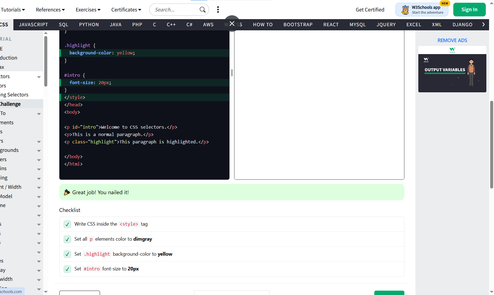
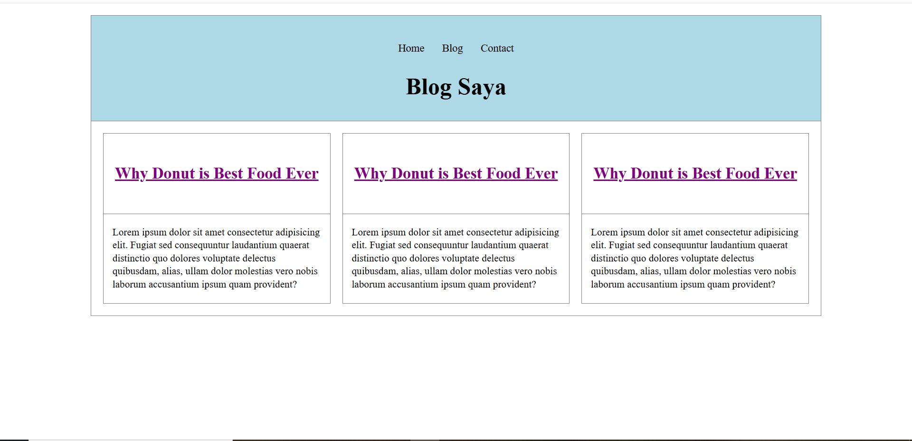
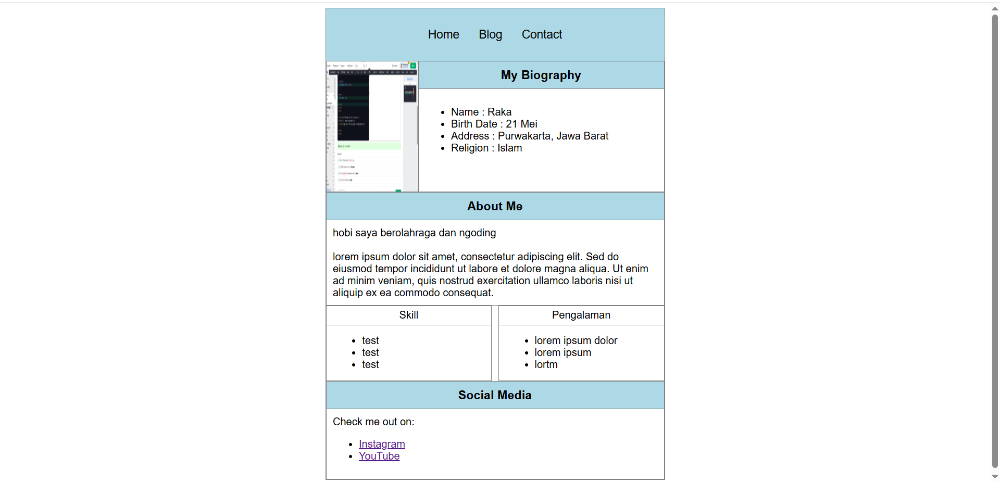

<!DOCTYPE html>
<html>
<head>
<title>My Biography</title>

</head>

<body>

<h3>My Biography</h3>

Name : Raka

Birth Date : 21 Mei

Address : Purwakarta, jawa barat

Religion : Islam

</ul>

<h3>About Me</h3>

lorem ipsum dolor sit amet, consectetur adipiscing elit. Sed do eiusmod tempor incididunt ut labore et dolore magna aliqua. Ut enim ad minim veniam, quis nostrud exercitation ullamco laboris nisi ut aliquip ex ea commodo consequat.

 

lorem ipsum dolor sit amet

<h3>Social Media</h3>

Check me out on:

<ul>
<li><a href="#">Instagram</a></li>
<li><a href="#">YouTube</a></li>
</ul>

</body>
</html>

